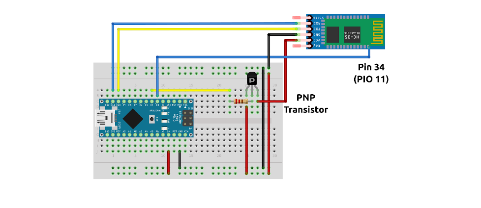

### HC-05 tool

This is tool for configuring and communicationg with cheap Bluetooth modules
HC-05. This firmware was mainly tested on Arduino Nano but should work on any
Arduino.

### Commands

* **echo** - run echo server. It is useful to check if your module is working.
  You run this command, connect to the module with your phone or PC and start
  sending some text to it. The module will receive the text, send it to Arduino,
  Arduino will send it back to the module and then module will send it back to
  you. 
* **atmode** - switch HC-05 into AT command mode.  The Arduino will just into
  serial passtrhogh device between your PC and HC-05. This allow you to
  communicate with Bluetooth module without any additional hardware (with the
  exception of Arduino of course). You can test if it works by sending `AT`
  command which should be answered with `OK`.
* **master <MAC-of-slave\> <name\>** - configure connected HC-05 module as
  Bluetooth master. It has two parameters. The first one is MAC address of the
  bluetooth device to which you want your module to connect immediately after
  boot. Note that MAC address should be in the following form `1234:12:123456` -
  not like classical one with lot of `:`. The second parameter is just Bluetooth
  name of your HC-05 module. Pretty useful to distinguish it from other HC-05
  slaves.
* **slave <name\>** - configure connected HC-05 module as Bluetooth slave. The
  same as for master you can configured name of the module.
* **name <name\>** - change Bluetooth name of the module. 
* **baudrate <baudrate\>** - change baudrate of the module. This baudrate is
  used when module communicates with Arduino.

### References:

* [Platformio](https://platformio.org/)
* [HC-05](https://www.aliexpress.com/wholesale?catId=0&SearchText=HC-05+Bluetooth)
